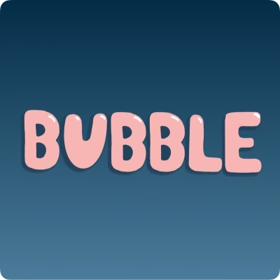
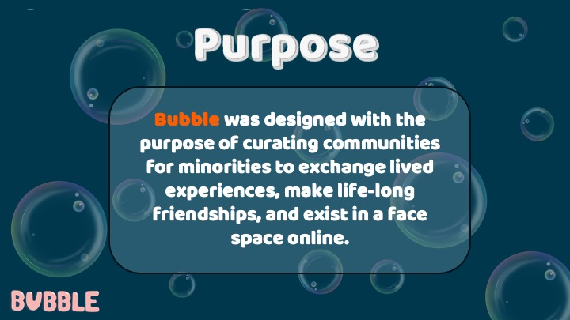
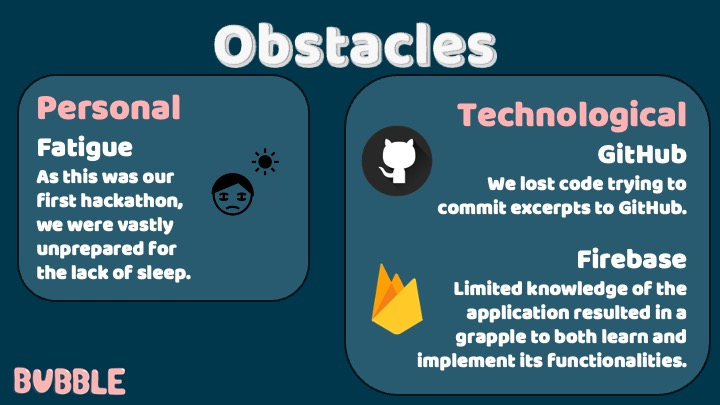
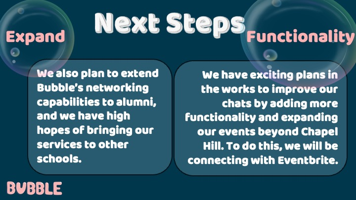
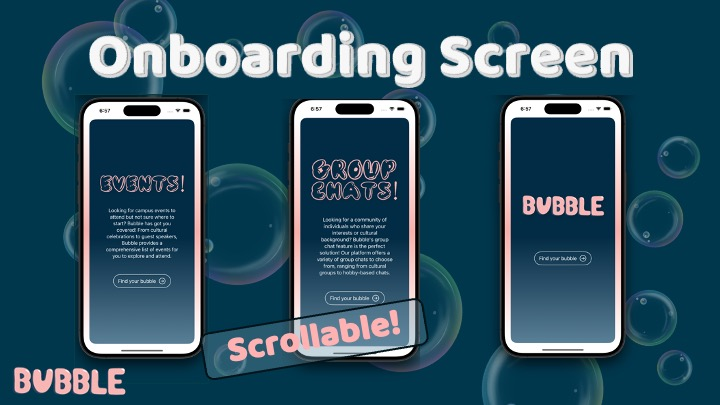
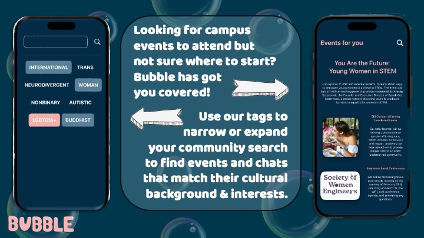
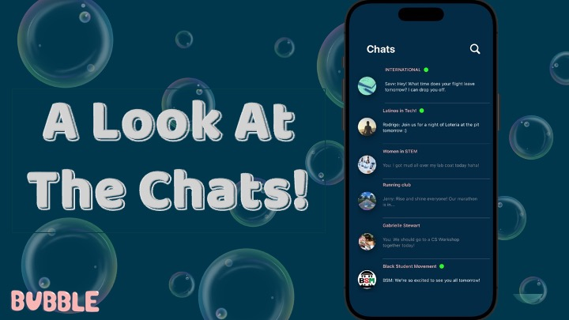
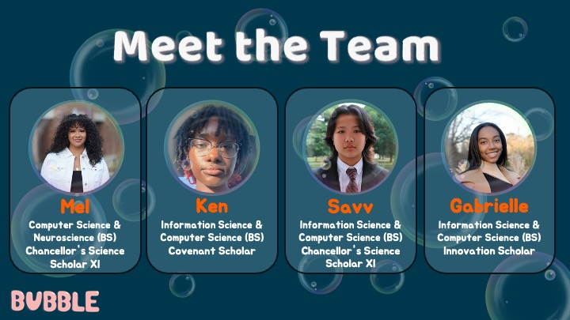

<!-- PROJECT SHIELDS -->
<!--
*** I'm using markdown "reference style" links for readability.
*** Reference links are enclosed in brackets [ ] instead of parentheses ( ).
*** See the bottom of this document for the declaration of the reference variables
*** https://www.markdownguide.org/basic-syntax/#reference-style-links
-->
[![Contributors][contributors-shield]][contributors-url]
[![Forks][forks-shield]][forks-url]
[![Stargazers][stars-shield]][stars-url]
 
[![Gabrielle's LinkedIn][g-linkedin-shield]][gabrielle-linkedin-url]
[![Savv's LinkedIn][s-linkedin-shield]][savv-linkedin-url]
[![Mel's LinkedIn][m-linkedin-shield]][mel-linkedin-url]
[![Kennedy's LinkedIn][k-linkedin-shield]][ken-linkedin-url]

<!-- PROJECT LOGO -->
  

<!-- <h3 align="center">Bubble</h3> -->
 

Are you looking for a community of like-minded individuals at UNC? Look no further than Bubble! Our platform connects UNC students with similar experiences and perspectives, providing a safe and welcoming space to meet new people and expand your network. Whether you're interested in joining niche group chats or attending events on campus, Bubble has something for everyone. We offer a wide range of options to help you connect with others who share your cultural background or interests so you'll always feel right at home.
  

Don't wait to find your bubble at UNC. Sign up for Bubble today!
 
 

  

PearlHacks 2024 Project Bubble: Finding communities for the underrepresented.
    
 

    <a href="https://github.com/gabrielleestewart/bubble"><strong>Explore the docs »</strong></a>
     
     
    <object data="https://appetize.io/embed/odowjqed4vlmevmooyxgqzwjvu?device=iphone14&scale=75&orientation=portrait&osVersion=17.2" type="text/html" width="100%" height="600px">
    <a href="https://appetize.io/embed/iudcliol5a3l3ihwlf4z7q4uqa?device=iphone14&scale=75&orientation=portrait&osVersion=17.2">View a demo of the app</a>
    </object>
    ·
    <a href="https://github.com/gabrielleestewart/bubble/issues">Report Bug</a>
    ·
    <a href="https://github.com/gabrielleestewart/bubble/issues">Request Feature</a>
  

 

<!-- TABLE OF CONTENTS -->

  
Table of Contents

  <ol>
    <li>
      <a href="#about-the-project">About The Project</a>
      <ul>
        <li><a href="#Inspiration">Inspiration</a></li>
      </ul>
      <ul>
        <li><a href="#What-it-does">What it does</a></li>
      </ul>
      <ul>
        <li><a href="#How-we-built-it">How we built it</a></li>
      </ul>
      <ul>
        <li><a href="#Challenges-we-ran-into">Challenges we ran into</a></li>
      </ul>
      <ul>
        <li><a href="#Accomplishments-that-we're-proud-of">Accomplishments that we're proud of</a></li>
      </ul>
      <ul>
        <li><a href="#What-we-learned">What we learned</a></li>
      </ul>
      <ul>
        <li><a href="#What's-next-for-Bubble">What's next for Bubble</a></li>
      </ul>
      <ul>
        <li><a href="#built-with">Built With</a></li>
      </ul>
    </li>
    <li><a href="#usage">Usage</a></li>
    <li><a href="#contact">Contact</a></li>
    <li><a href="#acknowledgments">Acknowledgments</a></li>
  </ol>

 

<!-- ABOUT THE PROJECT -->
## About The Project

  <a href="https://github.com/gabrielleestewart/bubble">
    
  <a href="https://github.com/gabrielleestewart/bubble">
    
  <a href="https://github.com/gabrielleestewart/bubble">
    
 
    
### Inspiration

Bubble was created with the inspiration of helping UNC students find a sense of community and belonging on campus. We recognized that students may feel isolated or disconnected from others who share their experiences and perspectives. Our goal was to create a platform that would bring students together in a safe and welcoming environment where they could connect with others who share their cultural background or interests. By providing a variety of group chats and events, we hoped to foster a sense of community and help students expand their networks. We believe everyone deserves to find their "bubble" at UNC, and that's why we created this platform.

### What it does

Bubble is a platform designed to connect students at UNC who share common experiences and perspectives. It provides a haven where users can comfortably meet new people and grow their network. With Bubble, you’ll find an inviting and welcoming space to expand your social circle and connect with like-minded individuals.

### How we built it

We utilized Swift and Firebase for our backend, while SwiftUI and Figma were our go-to tools for front-end development. We followed a collaborative workflow where each of us pushed our code to our respective branches, and we regularly merged and pulled changes from one another and the main branch.

### Challenges we ran into

We experienced some difficulties while attempting to upload excerpts to GitHub. Unfortunately, this resulted in the loss of some of our code. Our limited understanding of Firebase made learning and applying its features challenging. Additionally, being our first hackathon, we were not adequately prepared for the sleep deprivation, which led to fatigue.

### Accomplishments that we're proud of

We've compiled an extensive onboarding page showcasing all of Bubble's features. Our functional sign-up and sign-in screens are secured through Firebase authentication. To make it easier for users to find events and chats that match their cultural background and interests, we've implemented a tag system that can expand or narrow their community search.

### What we learned

We learned how to leverage Figma’s powerful design features to create visually pleasing and functional software. We discovered how Firebase could be used to implement a wide range of software functionalities. We explored the benefits of collaborating on GitHub in a single repository and learned how to compartmentalize tasks to work together more efficiently.

### What's next for Bubble

We have exciting plans in the works to improve our chats by adding more functionality and expanding our events beyond Chapel Hill. To do this, we will be connecting with Eventbrite. We also plan to extend Bubble’s networking capabilities to alumni, and we have high hopes of bringing our services to other schools.

 

### Built With

[![Swift][Swift]][Swift-url]
[![Swift UI][SwiftUI]][SwiftUI-url]
[![XCode][XCode]][XCode-url]
[![Figma][Figma]][Figma-url]
[![Firebase][Firebase]][Firebase]
[![Photoshop][Photoshop]][Photoshop-url]

(<a href="#readme-top">back to top</a>)

<!-- USAGE EXAMPLES -->
## Usage

  <a href="https://github.com/gabrielleestewart/bubble">
     
  <a href="https://github.com/gabrielleestewart/bubble">
    
  <a href="https://github.com/gabrielleestewart/bubble">
    
   

 

### Demo
<object data="https://appetize.io/embed/odowjqed4vlmevmooyxgqzwjvu?device=iphone14&scale=75&orientation=portrait&osVersion=17.2" type="text/html" width="100%" height="600px">
  <a href="https://appetize.io/embed/iudcliol5a3l3ihwlf4z7q4uqa?device=iphone14&scale=75&orientation=portrait&osVersion=17.2">View a demo of the app</a>
</object>

(<a href="#readme-top">back to top</a>)

<!-- CONTACT -->
## Contact

<br/ >
Mel Andrade-Muñoz - https://linkedin.com/in/andrademuñoz
<br/ >
<br/ >
Kennedy Cameron - https://linkedin.com/in/kennedy-cameron-4810b4249 
<br/ >
<br/ >
Savv Lin - https://linkedin.com/in/savvlin 
<br/ >
<br/ >
Gabrielle Stewart - https://linkedin.com/in/gabrielleestewart 
<br/ >
<br/ >
<br/ >
<br/ >

Git Hub Project Link: [https://github.com/gabrielleestewart/bubble](https://github.com/gabrielleestewart/bubble)

Pearl Hacks 2024 Project Devpost Link: https://devpost.com/software/bubble-vywgra?ref_content=my-projects-tab&ref_feature=my_projects

(<a href="#readme-top">back to top</a>)

<!-- ACKNOWLEDGMENTS -->
## Acknowledgments

[Shoutout to Pearl Hacks for this incredible opportunity!](https://pearlhacks.com)

(<a href="#readme-top">back to top</a>)

<!-- MARKDOWN LINKS & IMAGES -->
<!-- https://www.markdownguide.org/basic-syntax/#reference-style-links -->
[contributors-shield]: https://img.shields.io/github/contributors/gabrielleestewart/bubble.svg?style=for-the-badge
[contributors-url]: https://github.com/gabrielleestewart/bubble/graphs/contributors
[forks-shield]: https://img.shields.io/github/forks/gabrielleestewart/bubble.svg?style=for-the-badge
[forks-url]: https://github.com/gabrielleestewart/bubble/network/members
[stars-shield]: https://img.shields.io/github/stars/gabrielleestewart/bubble.svg?style=for-the-badge
[stars-url]: https://github.com/gabrielleestewart/bubble/stargazers
[issues-shield]: https://img.shields.io/github/issues/gabrielleestewart/bubble.svg?style=for-the-badge
[issues-url]: https://github.com/gabrielleestewart/bubble/issues
[g-linkedin-shield]: https://img.shields.io/badge/linkedin-gabrielle-white?style=for-the-badge&logo=linkedin&labelColor=%230A66C2
[s-linkedin-shield]: https://img.shields.io/badge/linkedin-savv-white?style=for-the-badge&logo=linkedin&labelColor=%230A66C2
[m-linkedin-shield]: https://img.shields.io/badge/linkedin-mel-white?style=for-the-badge&logo=linkedin&labelColor=%230A66C2
[k-linkedin-shield]: https://img.shields.io/badge/linkedin-ken-white?style=for-the-badge&logo=linkedin&labelColor=%230A66C2
[gabrielle-linkedin-url]: https://linkedin.com/in/gabrielleestewart
[savv-linkedin-url]: https://linkedin.com/in/savvlin
[mel-linkedin-url]: https://linkedin.com/in/andrademuñoz
[ken-linkedin-url]: https://linkedin.com/in/kennedy-cameron-4810b4249
<!-- [product-screenshot]: Slides/title.jpeg -->
[Swift]: https://img.shields.io/badge/swift-%23F05138?style=for-the-badge&logo=swift&logoColor=white
[Swift-url]: https://developer.apple.com/swift/
[SwiftUI]: https://img.shields.io/badge/swiftui-%233F8EF4?style=for-the-badge&logo=swift&logoColor=white
[SwiftUI-url]: https://developer.apple.com/xcode/swiftui/
[XCode]: https://img.shields.io/badge/Xcode-%23147EFB?style=for-the-badge&logo=xcode&logoColor=white
[XCode-url]: https://developer.apple.com/xcode/
[Figma]: https://img.shields.io/badge/figma-%23F24E1E?style=for-the-badge&logo=figma&logoColor=white
[Figma-url]: https://www.figma.com
[Firebase]: https://img.shields.io/badge/firebase-%23FFCA28?style=for-the-badge&logo=firebase&logoColor=white
[Firebase-url]: https://firebase.google.com
[Photoshop]: https://img.shields.io/badge/photoshop-%2331A8FF?style=for-the-badge&logo=adobephotoshop&logoColor=white
[Photoshop-url]: https://www.adobe.com/products/photoshop.html
